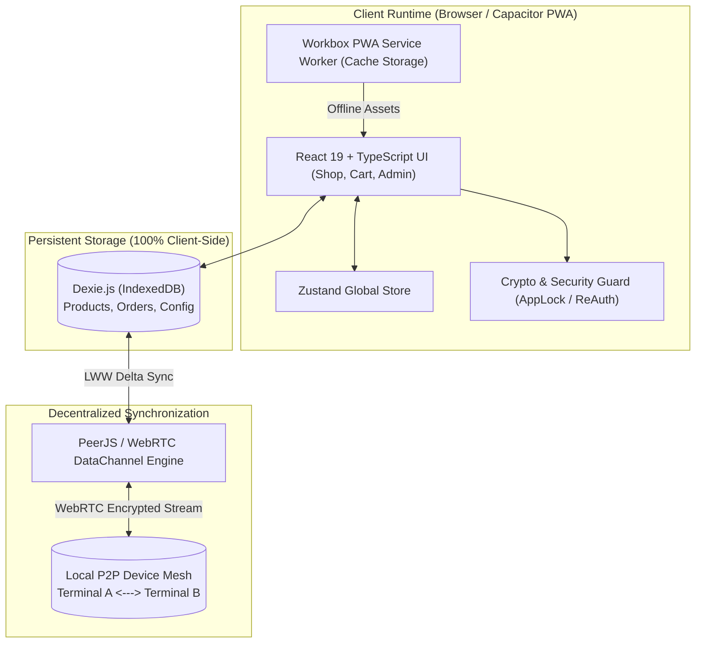

# 📱 ArbiTrack — Offline-First PWA & Decentralized P2P Retail Engine

<div align="center">

[](https://react.dev/)
[](https://www.typescriptlang.org/)
[](https://web.dev/progressive-web-apps/)
[](https://dexie.org/)
[](https://peerjs.com/)
[](https://capacitorjs.com/)
[](LICENSE)

**100% Offline-First Point-of-Sale (POS) & Mesh Synchronized Inventory Platform**

[Instant Start](#-instant-run--zero-friction-onboarding) &bull; [Architecture](#-system-architecture) &bull; [P2P Testing](#-p2p-mesh-sync-verification-multi-devicetab) &bull; [Contributing](#-contributing)

</div>

---

## 🌟 Overview

**ArbiTrack** is an offline-resilient retail commerce engine built for micro-merchants and high-reliability stores where internet access is intermittent or completely unavailable. 

Operating **100% client-side**, ArbiTrack stores catalogs, shopping carts, and order histories directly inside browser-native **IndexedDB via Dexie.js**. When multiple devices are on the same local network, ArbiTrack synchronizes inventory updates in real time using **PeerJS (WebRTC DataChannels)** &mdash; completely bypassing external cloud databases.

---

## 🏗️ System Architecture



---

## 🚀 Key Architectural Features

- **📶 100% Offline-First**: Instant app loads and checkout processing with zero network latency using Dexie.js ACID transactions.
- **🔗 Decentralized P2P Mesh Sync**: WebRTC DataChannels allow device-to-device stock updates without central server costs or single points of failure.
- **🛡️ Enterprise Security & RBAC**: PIN-based `AppLock`, device trust checking via `SecurityBanner`, and `withReAuth()` guards protecting admin panels.
- **📦 Pre-Seeded Evaluation**: Single-click demo catalog generation for zero-friction evaluation.
- **📲 Mobile Compilation Ready**: Configured for instant packaging into native Android & iOS binaries using Capacitor.

---

## 🏃 Instant-Run & Zero-Friction Onboarding

### 1. Installation & Development
```bash
git clone https://github.com/RohanKhadke20/ArbiTrack.git
cd ArbiTrack
npm install
npm run dev
```

### 2. Instant Pre-Seeded Catalog
Open [http://localhost:5173](http://localhost:5173) in your browser:
- If your catalog is empty, click the **🚀 Pre-Seed Demo Catalog** button on the home screen.
- Products, pricing, and stock levels will immediately populate for live checkout testing.

---

## 🧪 P2P Mesh Sync Verification (Multi-Device/Tab)

1. Open two browser windows:
   - **Terminal A (Retailer)**: Go to `/#/admin/sync` to view your unique Peer ID.
   - **Terminal B (Counter)**: Enter Terminal A's Peer ID and click **Connect**.
2. Once connected, update stock or complete a sale on Terminal A.
3. Observe real-time synchronization on Terminal B's IndexedDB without any cloud server!

---

## 📲 Native Mobile Packaging (Capacitor)

```bash
# Add Android native shell
npx cap add android

# Sync web bundle into native platform
npx cap sync android

# Open in Android Studio
npx cap open android
```

---

## 📜 License & Community

- Distributed under the **MIT License**. See [`LICENSE`](LICENSE) for details.
- Review [`CONTRIBUTING.md`](CONTRIBUTING.md) to propose enhancements or submit pull requests.
